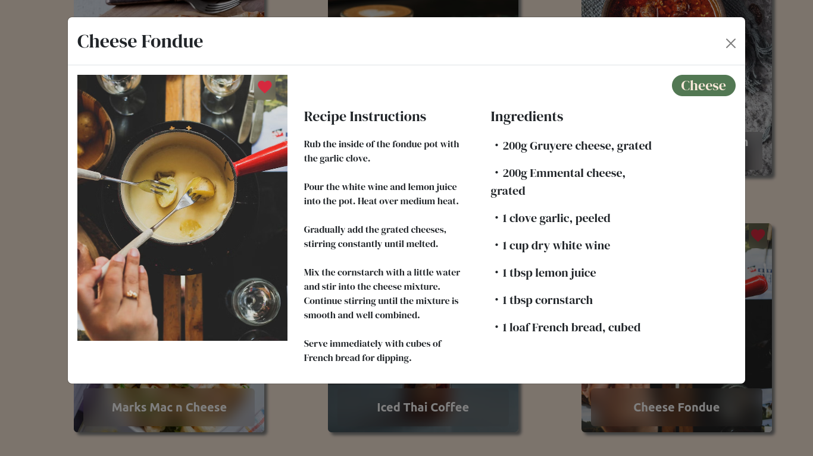

# AllSpice

AllSpice is a feature-rich recipe management tool. Users can post recipes, then edit the instructions and add, edit, or delete ingredients. They can also favorite other user's recipes and easily navigate to their favorites. Recipes can also be searched by category.

[See AllSpice live hosted here](https://allspice.corinnabolon.com)

## Technologies Used:
• Vue.js as a frontend JavaSript framework and Vue-Router for smooth navigation

• DotNet WebApi and C# for the backend

• MySQL as the database, using Dapper as the ORM

• Auth0 user authentication

## Key Features:

Recipe Management: Create, edit, and delete recipes. Owners have exclusive control over ingredients, steps, and recipe content.

Favorites: Logged-in users can mark recipes as favorites, enabling personalized recipe curation.

Search and Filter: Filter by all recipes, those which you created, and your favorites, as well as search recipes by category.

## What I learned from this project:
This is the first large project in which I used C# on the back end and MySQL as the database. As a result, some things such as the many-to-many relationships of favoriting a recipe were handled differently, and it was a great first experience at "flattening an object," putting all of the properties we need at the upper level. I also used queries in SQL to search for a category of recipe, which was my first time in any project to specifically use that method.
